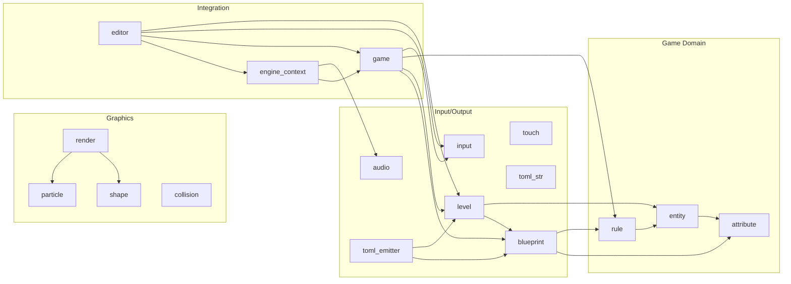

# Game Design & Architecture

## Vision

Sleipner is a top-down Zelda-like action RPG (Link to the Past / Link's Awakening style). Controller-first, pixel art, runs on Linux and Android.

The game is designed from within itself — an integrated editor mode allows building levels, composing entities, tuning collision, and testing gameplay without leaving the running game.

## In-Game Editor

The editor is a mode within the game, not a separate tool. Toggle between play mode and editor mode at any time. Everything is gamepad-driven.

### Core Principles

- **Edit what you see.** The editor operates on the live game world. Changes are immediately visible.
- **Gamepad-first.** Every editor action is reachable from a controller. No mouse/keyboard required (though keyboard shortcuts are fine as secondary input).
- **Always show the controls.** Every editor screen displays the current button mappings on-screen — what each button does in the current context. The user should never have to memorize or guess. Button hints update dynamically as the context changes (e.g. different hints when an entity is selected vs when nothing is selected).
- **Data, not code.** Levels, entity blueprints, collision shapes, and behavior parameters are data that the editor reads and writes. Game logic consumes this data at runtime.
- **The editor is the only tool.** Every single aspect of game data — without exception — must be editable from within the editor. If it's in `gamedata.toml`, it has an editor mode. There is no workflow that requires hand-editing the TOML file. The editor is the complete authoring environment for the game.
- **Round-trip.** Play, pause, edit, resume. The editor and the game share the same world state.

### Editor Modes

1. **Scene mode** — The main level editing mode. Free camera, select/place/move/delete entity instances, inspect properties, compose scenes.
2. **Blueprint mode** — Create and modify entity blueprints. Set texture, source rect, collision box, behavior, attributes, rules, children. All blueprints are listed and searchable. Changes propagate to all instances (unless overridden).
3. **Tile mode** — Paint terrain tiles on the grid. Ground and overlay layers. Tile palette with preview. Autotile placement.
4. **Atlas mode** — Set up sprite atlases. View the full texture, define named regions (source rects), preview individual sprites. This is how you tell the engine which rectangle of a sprite sheet corresponds to which sprite.
5. **Animation mode** — Define and preview animations. Set frame count, frame size, speed, row. Scrub through frames with the gamepad. Preview the animation playing on the entity. Link animation states (idle, walk, attack) to directional rows.
6. **Rule mode** — Build and test game logic. Visual rule editor with trigger/condition/action pickers. Test rules by switching to play mode and back.
7. **Level mode** — Manage levels. Create new levels, set level size, music, spawn points, transitions between levels. View all levels as a list or map.

### Editor UI

- Cursor controlled by left stick, snaps to grid (toggle-able).
- Color-coded overlays: collision boxes (green), spawn points (blue), trigger zones (yellow), rule indicators (orange).
- All input flows through the widget system described below — no raw text entry during normal editing.

### Gamepad Input Widgets

**Radial picker** — primary selection widget (4-12 items per ring):
- Tilt left stick to highlight, A to confirm, B to cancel.
- Nested rings for subcategories (e.g. action type → outer ring = category, inner ring = specific action).
- Used for: mode switching, tool selection, trigger/condition/action type picking, behavior type, etc.

**Scroll picker** — for longer lists:
- D-pad up/down to scroll, bumpers to page jump.
- Live fuzzy filter via the word builder — list narrows as you compose.
- Visual previews where applicable (texture thumbnails, sprite previews).
- Used for: blueprint palette, texture selection, flag/item references, level selection.

**Word builder** — composing names without a keyboard:
- Picks words one at a time from a vocabulary via scroll picker.
- Vocabulary is seeded from: (1) a built-in dictionary of common RPG words, (2) every name/flag/item/blueprint in the current gamedata.
- Most recently used and most frequent words bubble to the top.
- Underscore separator is automatic between words.
- "Done" (A) confirms, "Back" (B) removes last word.
- Built-in seed vocabulary includes: `chest`, `locked`, `magic`, `key`, `door`, `open`, `closed`, `hidden`, `secret`, `boss`, `enemy`, `spawn`, `trigger`, `zone`, `north`, `south`, `east`, `west`, `bridge`, `gate`, `switch`, `lever`, `fire`, `ice`, `water`, `stone`, `wood`, `gold`, `silver`, `sword`, `shield`, `bow`, `arrow`, `heart`, `potion`, `fairy`, `dark`, `light`, `cave`, `forest`, `dungeon`, `castle`, `village`, `temple`, `tower`, `path`, `wall`, `floor`, `roof`, `big`, `small`, `red`, `blue`, `green`, and more.

**Fuzzy finder** — for referencing existing things:
- When a field expects a blueprint name, flag, item, or level name, shows a fuzzy-matched list of everything that already exists in the gamedata.
- Stick navigates, matches re-rank in real time.
- 90% of the time the user is referencing something that already exists — this avoids typing entirely.

**Value adjuster** — for numbers:
- D-pad left/right for ±1, triggers for ±10, bumpers for ±100.
- Hold for auto-repeat with acceleration.
- Visual feedback: collision box edges move live, position updates in real time.

**Gamepad keyboard** — last resort for truly novel words:
- Radial character groups (vowels in one wedge, common consonants clustered).
- Predictive suggestions from the vocabulary as letters are entered.
- Only surfaces when the word builder can't find what you need.

### What You Can Edit

The editor provides full control over every aspect of the game data:

**Blueprint editing** — create and modify entity blueprints:
- Texture and source rect (visual sprite picker with preview).
- Collision box offset and size (drag handles, live visualization).
- Behavior type and params (radial picker + value adjusters).
- Animation settings (frames, size, speed, row).
- Rules: add/remove/edit triggers, conditions, and actions.
- Duplicate an existing blueprint as a starting point.

**Entity instance editing** — modify placed entities in the level:
- Position (left stick to drag, with optional grid snap).
- Per-instance overrides of any blueprint field.
- Collision box nudging with visual handles (corners and edges).
- Rule overrides (add instance-specific rules beyond the blueprint).

**Scene composition** — design entire levels:
- Place entities from the blueprint palette.
- Multi-select and group move.
- Copy/paste entities and groups.
- Level size adjustment.
- Tile painting (ground and overlay layers).
- Set level music, spawn point, transitions.

**Rule authoring** — build game logic visually:
- Pick trigger type (radial picker).
- Add conditions (fuzzy finder for existing flags/items).
- Chain actions (scroll through action types, fill params with pickers).
- Test rules immediately by switching to play mode.

### Editor Controls (Draft)

| Action | Gamepad | Keyboard |
|---|---|---|
| Toggle editor | Select + Start | F2 |
| Move cursor | Left stick | Arrow keys |
| Select / confirm | A (south) | Space |
| Cancel / back | B (east) | Escape |
| Open palette | Y (north) | Tab |
| Cycle tools | Bumpers | Q / E |
| Adjust value | D-pad / triggers | +/- |
| Delete selected | X (west) | Delete |
| Save level | Start (in editor) | Ctrl+S |
| Undo | LB + B | Ctrl+Z |
| Duplicate selected | RB + A | Ctrl+D |
| Multi-select toggle | LT (hold) | Shift (hold) |
| Grid snap toggle | RT + D-pad up | G |

## Entity System

Composition over inheritance. An entity is an ID plus a bag of attributes.

### Attributes

Every entity has **attributes** — typed key-value pairs. Some are built-in (the engine knows about them), others are custom (user-defined per blueprint). All attributes participate in the same system — rules can read/write any of them.

**Built-in attributes** (always present on every entity):

| Attribute | Type | Purpose |
|---|---|---|
| `position` | vec2 | World position (or offset from parent) |
| `health` | int, int | Current and max health |
| `visible` | bool | Whether the entity renders |
| `active` | bool | Whether rules and behavior run |
| `solid` | bool | Whether collision is enabled |
| `opacity` | float | Render opacity (0.0–1.0) |

**Custom attributes** — defined freely per blueprint, any name and type:
- Types: float, int, bool, string.
- Examples: `speed = 80.0`, `patrol_radius = 50`, `is_locked = true`, `loot_table = "common"`.
- No fixed cap — stored in the arena, variable count per blueprint.

### Attribute Scoping (Blueprint vs Instance)

Blueprints define default attribute values. Instances override only what differs. Reading an attribute checks the instance first, then falls back to the blueprint.

```toml
[[blueprint]]
name = "chest"
texture = "chest.png"
src = [0, 0, 16, 16]
collision_offset = [0, 0]
collision_size = [16, 16]
behavior = "static"
health = [1, 1]
is_locked = true
loot_table = "common"

[[level.entity]]
blueprint = "chest"
pos = [300, 100]
# inherits is_locked = true, loot_table = "common"

[[level.entity]]
blueprint = "chest"
pos = [160, 280]
is_locked = false          # override: this one is unlocked
loot_table = "rare"        # override: better loot
```

The editor shows overridden attributes highlighted differently from inherited ones (attribute diff view).

### Blueprint Inheritance

A blueprint can extend another blueprint, inheriting all its attributes and rules. The child blueprint overrides or adds what differs.

```toml
[[blueprint]]
name = "locked_chest"
extends = "chest"
is_locked = true

[[blueprint.rule]]
trigger = "interact"
conditions = ["self.attr:is_locked", "has_item:key"]
actions = [
  "remove_item:key",
  "set_attr:self.is_locked,false",
  "dialogue:Unlocked!",
]
```

### Entity Composition and Children

An entity can contain child entities. Children are positioned relative to their parent and have their own attributes, rules, and behaviors.

```toml
[[blueprint]]
name = "wagon"
texture = "wagon_body.png"
src = [0, 0, 64, 32]
speed = 30.0

[[blueprint.child]]
blueprint = "lantern"
tag = "lantern"
offset = [56, -8]

[[blueprint.child]]
blueprint = "wheel"
tag = "front_wheel"
offset = [8, 28]

[[blueprint.child]]
blueprint = "wheel"
tag = "rear_wheel"
offset = [48, 28]
```

Use cases:
- NPC with equipment slots (child entities with own sprites and stats).
- Complex objects assembled from parts.
- A boss with independently targetable limbs.
- Particle emitters attached to entities.

Children inherit parent `visible` and `active` state but can override. Destroying the parent destroys all children.

### Tags

Tags let any entity in a composition tree reference any other entity in the same tree by name, regardless of nesting depth.

**Implicit tags** (always available):

| Tag | Refers to |
|---|---|
| `self` | This entity |
| `parent` | Immediate parent |
| `root` | Top-level entity in the tree |

**Custom tags** — assigned to children via the `tag` field. Must be unique within a tree. The editor enforces uniqueness and the fuzzy finder shows existing tags.

**Referencing attributes across the tree:**

```
main_weapon.attr:damage       # tagged child's attribute
parent.attr:health            # parent's attribute
root.attr:active              # root entity's attribute
shield.attr:defense           # any tagged family member
```

**Example — cursed sword that drains the wielder:**

```toml
[[blueprint]]
name = "cursed_sword"
damage = 15
drain = 2

[[blueprint.rule]]
trigger = "timer:1"
conditions = ["self.attr:equipped"]
actions = ["add_attr:root.health,-2"]
```

### Behaviors

Behaviors are coded in C and referenced by ID. They implement runtime logic that can't be pure data — physics, input, animation state machines. Examples:

- `static` — Does nothing (trees, rocks, decorations).
- `player` — Reads input, moves, animates.
- `npc_walk` — Walks a patrol path, stops, turns.

The behavior params array holds floats that the behavior interprets (e.g. patrol speed, interaction radius). The editor exposes these as named fields based on the behavior_id.

Most game logic that used to require dedicated behaviors (chests, doors, triggers) is now handled by the rule system instead.

### Rules (Visual Scripting System)

Rules are the data-driven scripting system — inspired by the Warcraft 3 World Editor trigger system. Each entity can have zero or more rules. Simple rules stay simple (flat string lists). Complex rules use structured control flow, variables, and entity queries. The goal is that rules should never feel limiting — anything you'd want game logic to do should be expressible without writing C.

#### Triggers

| Trigger | Fires when |
|---|---|
| `interact` | Player presses A near the entity |
| `enter` | Player steps into the entity's zone |
| `collide` | Entity touches another entity |
| `defeat` | Entity health reaches 0 |
| `timer:N` | N seconds elapsed (one-shot) |
| `timer_periodic:N` | Every N seconds (repeating) |
| `event:name` | A custom named event is fired (by another rule) |
| `on_spawn` | Entity is created/instantiated |
| `on_destroy` | Entity is about to be destroyed |
| `attr_changed:X` | Attribute X on self changes value |

#### Conditions

Conditions support AND/OR/NOT grouping. A flat list is implicit AND (backwards compatible). For complex logic, use `{ or = [...] }` and `{ not = "..." }`.

| Condition | True when |
|---|---|
| `has_item:X` | Player has item X |
| `flag:X` | Global flag X is set |
| `not_flag:X` | Global flag X is not set |
| `attr:X` | Attribute X on self is truthy |
| `attr:X<N` / `attr:X>N` / `attr:X==N` | Numeric comparison |
| `not_attr:X` | Attribute X on self is falsy |
| `tag.attr:X` | Attribute on tagged family member |
| `var:X` | Variable X is truthy |
| `var:X<N` / `var:X>N` / `var:X==N` | Variable comparison |
| `entity_count:blueprint<N` | Count of active entities of a blueprint type |
| `{ or = [...] }` | Any sub-condition is true |
| `{ and = [...] }` | All sub-conditions are true (explicit) |
| `{ not = "..." }` | Sub-condition is false |

#### Actions

| Action | Effect |
|---|---|
| `give_item:X` | Add item to inventory |
| `remove_item:X` | Consume item from inventory |
| `set_flag:X` | Set a global flag |
| `clear_flag:X` | Unset a global flag |
| `set_attr:target.X,V` | Set attribute on self or tagged entity |
| `add_attr:target.X,V` | Add to numeric attribute |
| `toggle_attr:target.X` | Flip a boolean attribute |
| `change_sprite:x,y,w,h` | Swap source rect (e.g. open chest) |
| `play_sound:file` | Play a sound effect |
| `dialogue:text` | Show dialogue box |
| `transition:level,x,y` | Go to level at position |
| `spawn:blueprint,x,y` | Create entity at position |
| `destroy` | Remove the entity |
| `camera_pan:x,y,duration` | Pan camera over time |
| `camera_shake:duration` | Screen shake effect |
| `fire_event:name` | Fire a custom named event (other rules can trigger on it) |
| `call:subroutine_name` | Execute a named subroutine |
| `set_var:name,value` | Set a local or global variable |
| `wait:seconds` | Pause execution for N seconds (async, doesn't block the game) |
| `create_timer:name,seconds` | Create and start a named timer |
| `destroy_timer:name` | Stop and remove a named timer |

#### Variables

Variables store typed values (int, float, bool, string, entity reference). Two scopes:

- **Local variables** — scoped to a single rule execution. Created with `set_var`, vanish when the rule finishes. Used for intermediate calculations, loop counters, temporary references.
- **Global variables** — persist across rule executions and save/load. Accessed with `global.var_name`. More powerful than flags (which are just boolean globals) — globals can store numbers, strings, entity references.

Variables can be used as action parameters via `$` prefix: `add_attr:$.health,-$damage`.

#### Control Flow

Actions can include structured control flow, turning the action list into a visual program:

**If/else:**
```toml
actions = [
  { if = "has_item:key", then = [
    "remove_item:key",
    "call:unlock_door",
  ], else = [
    "dialogue:It's locked.",
  ]},
]
```

**Loops:**
```toml
actions = [
  # Repeat N times
  { repeat = 3, do = [
    "spawn:enemy_bat,$random_x,$random_y",
  ]},
]
```

**For-each (entity queries):**
```toml
actions = [
  # For each entity matching a condition within a radius
  { for_each = "entity_in_radius:100", condition = "attr:is_destructible", do = [
    "add_attr:$.health,-$damage",
    "spawn:smoke_particle,$.position",
  ]},
]
```

The `$` inside a for-each body refers to the current entity being iterated. `$.health` is that entity's health, `$.position` is its position.

#### Subroutines

Named, reusable action sequences — callable from any rule via `call:name`. Avoids duplicating logic across rules. Defined at the top level of gamedata:

```toml
[[subroutine]]
name = "unlock_door"
actions = [
  "play_sound:door_unlock.wav",
  "set_attr:self.is_locked,false",
  "change_sprite:16,0,16,16",
  "dialogue:The door opens.",
]
```

#### Custom Events

Events decouple complex interactions across entities. One rule fires an event, any number of rules in any entities can trigger on it:

```toml
# Boss entity fires event on defeat
[[blueprint.rule]]
trigger = "defeat"
actions = ["fire_event:boss_defeated"]

# Gate entity in a different part of the level reacts
[[blueprint.rule]]
trigger = "event:boss_defeated"
actions = [
  "set_attr:self.solid,false",
  "change_sprite:0,16,32,32",
  "play_sound:gate_open.wav",
]

# Music entity reacts too
[[blueprint.rule]]
trigger = "event:boss_defeated"
actions = ["play_sound:victory_fanfare.wav"]
```

#### Complete Example

```toml
# Explosion trap with area damage, hard mode scaling, and cleanup
[[blueprint]]
name = "explosion_trap"
behavior = "static"
damage = 50

[[blueprint.rule]]
name = "explode_on_enter"
trigger = "enter"
actions = [
  "set_var:damage,50",
  { if = "flag:hard_mode", then = [
    "set_var:damage,100",
  ]},
  "play_sound:explosion.wav",
  "camera_shake:0.5",
  { for_each = "entity_in_radius:100", condition = "attr:is_destructible", do = [
    "add_attr:$.health,-$damage",
  ]},
  "spawn:fire_zone,self.position",
  "set_flag:trap_triggered",
  "destroy",
]
```

#### Implementation

The C side has one function per action type and one per condition type. The rule engine walks the action tree: flat strings are simple actions, inline tables are control flow nodes. Adding a new action/condition/trigger type is one C function — automatically available in the editor.

The editor renders rules as a visual tree (like WC3's trigger view), navigated with the gamepad. Each node is selectable, expandable, and editable with radial pickers and the word builder.

**Flags** are syntactic sugar for boolean global variables. `set_flag:X` is equivalent to `set_var:global.X,true`. They persist with save data and gate progression.

### Live Edit/Play Flow

- **Toggle is instant** — shared world state, no reload delay.
- **Edit mode**: game paused, free camera, select and modify attributes. Changes are visible immediately — move a collision box and see it update live.
- **Play mode**: game runs with current state. Changes made in edit mode are in effect.
- **Play-from-here**: resume without resetting state (test a specific scenario mid-action).
- **Restart level**: reload from gamedata, reset all runtime state.
- **Attribute watcher**: pin attributes to the debug overlay — see them update in real time during play. Pick entities, pick attributes, they display as a live HUD.

## Multiplayer

### Network Model

- **LAN-based** — optimized for couch co-op on the same WiFi/subnet. Low latency assumed.
- **Host-authoritative** — one player hosts, others join. The host runs the simulation. Clients send inputs, receive state.
- **UDP** for frequent state updates (positions, attribute changes). Reliable channel (TCP or reliable UDP) for important events (rule triggers, item pickups, editor operations).
- **LAN discovery** — host broadcasts presence on the local network. Clients see available games and join without entering an IP address.

### Player Model

- Each player has their own device, own screen, own camera.
- **No player cap** — protocol designed for N players, optimized for 2–4.
- Players can be in the same level or different levels simultaneously.
- Each player entity is **owned by its player** — only that player's inputs move it.
- NPCs and world entities are owned by the host.

### Input Abstraction

- Entity attribute `input_source` identifies where input comes from: `local:0` (gamepad 0), `local:1`, `network:player_id`.
- The player behavior reads from the input source, not a hardcoded gamepad index.
- Adding a new player = spawn a player entity with a new input source. No code changes needed.

### State Sync

- Host sends **attribute deltas** (only what changed since last tick) to all clients.
- Clients send their **input state** each tick to host.
- On join: host sends a **full state snapshot**, client catches up.
- Entity composition trees sync as a unit — parent + all tagged children.
- Rules execute on the host only — clients see the results via attribute deltas.

### Camera

- Each client runs its own camera following its own player entity.
- Camera logic is entirely local — not synced over the network.
- All clients render from the same world state but from their own viewpoint.

### Collaborative Editor

- **Multiple cursors** — each player has their own cursor, colored and labeled with their name.
- **Entity locking** — selecting an entity claims it. Others see it highlighted in the owner's color and cannot modify it until released.
- **Live sync** — edit operations are synced as they happen. All players see changes in real time.
- **Per-player undo** — each player has their own snapshot stack. Undoing only affects that player's changes.
- **Save is host-only** — the host writes `gamedata.toml`. Any player can request a save, but the host executes it.
- All editor widgets (radial picker, word builder, fuzzy finder) work identically for every player.

## Save System

### Two Files, Two Concerns

- **`gamedata.toml`** = the game (level design, blueprints, rules). Shared via Syncthing, versioned in git. Never contains player progress.
- **Save file** = runtime world state. One save captures the complete host state — all players, all global variables, all entity modifications. It's the world, not a character sheet.

### Storage Location

Save files live in app-local storage, **not** Syncthing. Syncthing is for creative data (gamedata.toml). Saves are runtime state — syncing them would cause conflicts if two devices play simultaneously.

- Desktop: `~/.local/share/sleipner/saves/`
- Android: app internal storage

### Persistent World State

The world has one persistent state. Everything persists by default:
- Kill an enemy → it stays dead.
- Open a chest → it stays open.
- Move an object → it stays moved.

Respawning is explicit — a timer rule, a `fire_event:respawn_enemies` trigger, or a design decision in the rules. The game designer decides what resets, not the engine.

### Save Format

TOML, same parser/emitter as gamedata. The save stores the **delta from the gamedata baseline** — only what changed. Anything not in the save is at its blueprint/level default. This keeps saves small.

```toml
[meta]
timestamp = 2026-03-16T19:30:00
playtime = 3600

# All players in this world
[[player]]
name = "player_1"
level = "overworld"
position = [320, 180]
health = [7, 10]
direction = "down"
items = ["sword", "key", "potion"]
equipment = { main_weapon = "iron_sword", shield = "wooden_shield" }

[[player]]
name = "player_2"
level = "overworld"
position = [340, 180]
health = [10, 10]
items = ["bow", "arrow", "arrow"]

[globals]
chest_1_opened = true
boss_defeated = false
bridge_repaired = true

# Entities modified from their gamedata baseline
# Only stores the delta — what changed from blueprint/level defaults
[[entity_state]]
level = "overworld"
entity_id = 6
destroyed = true

[[entity_state]]
level = "dungeon_1"
entity_id = 3
attrs = { health = [2, 5] }
```

### Loading

1. Load `gamedata.toml` — the designed world (blueprints, levels, rules).
2. Apply `entity_state` deltas from the save file on top — destroyed entities are removed, modified attributes are overridden.
3. Restore player positions, inventories, equipment.
4. Restore global variables.

### Save Slots

Multiple numbered files: `save_1.toml`, `save_2.toml`, etc. Each stores a timestamp and current level name for the slot selection screen. Auto-save goes to a dedicated `autosave.toml` that doesn't overwrite manual saves.

### Auto-Save

- On every level transition.
- On quit.
- Manual save via pause menu.

### Multiplayer

The host owns the save. All players are stored in the same save file. When a player joins, their character section is created. When they leave, their state persists in the save for when they rejoin.

## Data Architecture

Game data is split into two concerns with separate storage:

### Asset Database (`assets/`)

Binary resources: sprites, music, sound effects. These rarely change, are large, and don't diff well. Checked into git as-is. Loaded at runtime from the filesystem via raylib.

```
assets/
├── sprites/       # .png sprite sheets and tiles
├── music/         # .mp3/.ogg background tracks
└── sfx/           # sound effects
```

### Game Data (`data/gamedata.toml`)

All game data — blueprints, levels, tile palettes — lives in a **single file**. This is the creative output that the editor reads and writes. Must be:

- **Git-friendly:** Plain text, line-oriented, diffs show meaningful changes.
- **Live-editable:** The game reads/writes this file at runtime.
- **Synced:** Hard-linked into the Syncthing directory so both git and Syncthing see the same inode.

Why a single file: hard links only work on files, not directories. A single file lets us hard-link it into the Syncthing share so edits from either side (phone or dev machine) are instantly visible to both git and Syncthing without symlink indirection.

### Syncthing Pipeline

```
  Phone (editor)                       Dev machine (git)
  ──────────────                       ─────────────────
  Edit in-game, save                   Edit by hand or via Claude
        ↓                                    ↓
  ~/Sync/sleipner/gamedata.toml  ←→     data/gamedata.toml
  (hard link to same inode             (hard link to same inode
   on dev machine)                      in Syncthing share)
                                             ↓
                                       git commit & push
```

**Setup:** `ln data/gamedata.toml ~/Sync/sleipner/gamedata.toml`

**Desktop path:** Game reads `data/gamedata.toml` (relative to binary / repo root).
**Android path:** Game reads from Syncthing folder (e.g. `/storage/emulated/0/Sync/sleipner/gamedata.toml`).

Both sides edit the same file. Syncthing syncs to the phone. Git versions the repo copy. The hard link means they are the same file on the dev machine — no copy step needed.

Note: hard links break when either side does a delete+recreate instead of in-place write. Syncthing and most text editors preserve inodes on save, but this is worth keeping in mind.

### Game Data Format (TOML)

TOML via [tomlc99](https://github.com/cktan/tomlc99) (vendored at `engine/vendor/tomlc99/`). Human-readable, supports comments, clean diffs — each `[[blueprint]]` or `[[level.entity]]` block is a self-contained addition/removal in git.

```toml
# === Blueprints ===

[[blueprint]]
name = "tree"
texture = "tree.png"
src = [0, 0, 64, 80]
collision_offset = [20, 60]
collision_size = [24, 16]
behavior = "static"

[[blueprint]]
name = "chest"
texture = "chest.png"
src = [0, 0, 16, 16]
collision_offset = [0, 0]
collision_size = [16, 16]
behavior = "chest"

[[blueprint]]
name = "house"
texture = "house.png"
src = [0, 0, 96, 128]
collision_offset = [0, 64]
collision_size = [96, 64]
behavior = "static"

[[blueprint]]
name = "fence_v"
texture = "fence.png"
src = [0, 0, 16, 48]
collision_offset = [0, 0]
collision_size = [16, 48]
behavior = "static"

[[blueprint]]
name = "player"
texture = "player.png"
src = [0, 0, 32, 32]
collision_offset = [11, 22]
collision_size = [10, 10]
behavior = "player"
speed = 80.0
animation = { frames = 6, size = 32, speed = 10, row = 0 }

# === Levels ===

[[level]]
name = "overworld"
size = [640, 360]
music = "bgm.mp3"

[[level.entity]]
blueprint = "house"
pos = [40, 20]

[[level.entity]]
blueprint = "tree"
pos = [200, 60]

[[level.entity]]
blueprint = "tree"
pos = [350, 150]

[[level.entity]]
blueprint = "chest"
pos = [300, 100]

[[level.entity]]
blueprint = "player"
pos = [320, 180]
```

### Runtime Loading

- On startup, the game reads `gamedata.toml` via tomlc99.
- `[[blueprint]]` entries are registered in a lookup table (name → component defaults).
- The active `[[level]]` is selected and its `[[level.entity]]` entries are instantiated from their blueprints. Per-instance fields override blueprint defaults.
- The editor modifies in-memory state and writes the entire file back on save via a TOML serializer (tomlc99 is read-only, so we write a simple emitter ourselves).
- Hot-reload: optionally watch the file's mtime and reload when it changes (useful when editing on phone while running on desktop, or vice versa).

## Module Dependencies

The engine is structured as an acyclic dependency graph. Lower-level modules (arena, alloc,
strings) know nothing about the game; higher-level modules (game, editor) compose them. No
circular includes exist — cycles are broken by the patterns described in "Cross-Module
Dependencies" below.

### Header dependency graph

Foundation modules (`alloc`, `arena`, `vec`, `str`, `map`, `error`, `debug`, `rect`, `strv`,
`assets`) and vendor libraries (`raylib`, `toml`) are used pervasively and omitted from the
graph to reduce noise. Only domain-level and structural dependencies are shown.



### `struct EngineContext` forward declaration spread

13 headers forward-declare `struct EngineContext;` to accept an `EngineContext *` parameter
without including `engine_context.h` (which sits at the top of the dependency tree):

```
alloc.h, arena.h, audio.h, blueprint.h, collision.h, debug.h,
error.h, game.h, input.h, level.h, rule.h, vec.h, map.h
```

This is the single remaining architectural violation of the "no opaque cross-module forward
declarations" rule. The fix is to decompose `EngineContext` — extract the pieces each module
actually needs (error context, log sink, arena pointers) into lightweight structs that live
at the foundation level. See TODO.md for the plan.

## Memory Architecture

All engine memory is arena-backed — no `malloc`/`free` anywhere except tomlc99 vendor internals and the allocator infrastructure's `NULL` fallback. The two arenas in `GameState` have distinct lifetimes, and data is loaded incrementally in layers.

### Data Lifecycle

```
1. Compile time
   Asset bytes (PNG, TTF, MP3) embedded in .rodata via .incbin.
   Zero runtime I/O for assets — they're part of the binary.

2. Startup — game_init()
   Two arenas allocated via mmap(MAP_ANONYMOUS|MAP_NORESERVE).
   1 TiB virtual reservation each; physical pages demand-paged.
   Both start empty.

3. Asset registration — once per process
   Raylib decodes raw bytes → GPU VRAM (not in arena).
   Small registry structs (TextureEntry, FontPreviewEntry) pushed
   into gamedata_arena via arena allocator.
   gamedata_base checkpoint saved — marks the floor of this zone.

4. Gamedata load — game_load_gamedata()
   File read into scratch buffer, TOML parsed (tomlc99 uses its
   own heap — vendor exception). Blueprints, level, rules stored
   in gamedata_arena above gamedata_base. tomlc99 tables freed.

5. Game loop — update/render cycle
   Scratch allocations via SCRATCH_SCOPE(&state.scratch_arena).
   Offset auto-restored at scope exit; no syscall, bare rewind.

6. Hot-reload / level transition
   arena_restore(&state->gamedata_arena, state->gamedata_base)
   rewinds gamedata_arena to the checkpoint. Asset registry at the
   bottom is untouched. Step 4 runs again.

7. Shutdown — game_free()
   arena_free() munmaps both arenas (returns virtual range to OS).
   Raylib unloads GPU textures and fonts.
```

### Arena Zone Layout

```
gamedata_arena:
  [0 .. gamedata_base)    textures + fonts (survive all reloads)
  [gamedata_base .. top)  blueprints, level, rules (rewound on reload)

scratch_arena:
  [checkpoint .. top)     per-scope temporaries (rewound at SCRATCH_SCOPE exit)
```

### Runtime Arena (planned)

Currently all entity instance data lives in `gamedata_arena` alongside blueprints and
rules. This means hot-reloading gamedata wipes all runtime state (entity positions, HP
overrides, spawned entities, editor changes). To support hot-reload with preserved runtime
state, the plan is to split into two data arenas:

- **`gamedata_arena`** — the "definition" layer. Blueprints, rules, level templates —
  everything parsed from `gamedata.toml`. Wiped and re-parsed on reload.
- **`runtime_arena`** — the "instance" layer. Live entities, attribute overrides,
  spawned/deleted markers, editor mutations. Survives reloads for the lifetime of the
  game session.

**All cross-object references are by ID or name, never by pointer.** This applies to
both runtime→gamedata and runtime→runtime references. An entity holds its blueprint as a
name string, not a `Blueprint *`. An entity refers to its parent by entity ID, not an
`Entity *`. Attribute access is by name string. This rule exists for two reasons:

1. **Hot-reload safety.** Reloading gamedata changes all gamedata addresses. String
   lookups naturally re-resolve against the fresh data — no migration needed.
2. **Vec growth safety.** Within the runtime arena, vec growth can orphan old backing
   arrays (bump + leak). Any `Entity *` or `Attribute *` cached across a vec push becomes
   stale. ID/name lookups are always re-derived from the current vec state.

Pointers returned by lookups are valid within the current scope — derive, use, discard.
Never store a cross-object pointer in a struct field or hold it across a call that might
grow a vec or reload gamedata. Direct vec indexing within a function (e.g.
`level->entities.data[i]`) is fine — the rule targets stored pointers that outlive their
validity, not scoped access into your own data.

Reloading gamedata becomes:

1. `arena_restore(gamedata_arena, gamedata_base)` + re-parse `gamedata.toml`.
2. Done. The runtime arena is untouched. String/ID lookups naturally re-resolve.

No migration, no snapshot/reconcile. The only cost is string/ID-based lookups at object
boundaries. If profiling shows these are hot, cache the resolved pointer with
invalidation on reload or vec growth — the cache is a performance optimization, not a
correctness requirement.

**Editor implications.** Edits to instance attributes (move an entity, change its HP) go
into the runtime arena. Edits to blueprint attributes (change collision size for all
entities of a type) go into gamedata and get written back to TOML. The two concerns never
share memory.

```
gamedata_arena (after runtime arena split):
  [0 .. gamedata_base)    textures + fonts (survive all reloads)
  [gamedata_base .. top)  blueprints, rules, level templates (rewound on reload)

runtime_arena:
  [0 .. top)              live entities, instance attrs, spawned state (survives reloads)

scratch_arena:
  [checkpoint .. top)     per-scope temporaries (rewound at SCRATCH_SCOPE exit)
```

#### Lookup functions for cross-object references

Cross-object references (entity→blueprint, entity→parent, etc.) must go through dedicated
lookup functions that translate an ID or name into a pointer. Examples:

- `blueprint_by_name(state, "chest")` → `Blueprint *`
- `entity_by_id(level, 42)` → `Entity *`
- `attr_get_int(attrs, "hp")` → `int`

The returned pointer is valid within the current scope — use it and discard it. Never
store it in a struct field or hold it across a call that might mutate the backing data.

**Direct vec indexing within a scope is fine.** Accessing `level->entities.data[i]` to
work with an element you already have an index for is normal — it's a direct access into
your own data, not a cross-object reference. The rule targets *stored pointers that
outlive their validity*, not how you access elements within a function.

This buys two things:

1. **Single point of optimization.** If profiling shows a lookup is hot, add caching
   inside the lookup function itself — callers don't change. A generation counter on the
   backing vec lets the function serve a cached pointer when the generation matches and
   re-derive when it doesn't.
2. **Single point of invalidation.** Only the lookup function knows about the cache, so
   only the lookup function needs invalidation logic. No scattered caches across
   subsystems, no observer pattern, no central registry.

**Cache state lives on the container, not the caller.** The lookup function already
receives the container struct (`Level *`, `GameState *`). If caching is added later, the
cache (generation counter, resolved-pointer table) becomes a field on that container
struct. The lookup function has access to both the data and the cache through the pointer
it already receives — call sites don't change and don't need to know caching exists.

```c
// No cache — works today:
Entity *entity = entity_by_id(&level, 42);

// Cache added later inside Level — exact same call site:
Entity *entity = entity_by_id(&level, 42);
```

The recommendation is to ship without caching — make the lookup functions fast (hash maps
for name→index, flat arrays for ID→entity) and only add the generation-counter cache if
profiling proves a specific lookup is a bottleneck. The architecture supports bolting it
on later without changing any call site.

#### Entity–blueprint connection

An entity is an instance of a blueprint. The blueprint defines default attribute values; the
entity holds runtime overrides. Attribute lookup is a two-level operation: check instance
attrs first, fall back to blueprint defaults. This two-level scoping is a deliberate design
choice — it preserves the distinction between "what the blueprint says" and "what happened at
runtime," which is essential for hot-reload migration and the editor's separate
instance/blueprint display.

**Do not copy blueprint defaults into instance attrs.** This was tried and reverted. Copying
destroys the override/default distinction, wastes arena memory for attrs that are never
overridden, and makes hot-reload migration impossible (can't tell which instance attrs are
runtime overrides vs copies of defaults).

**Implementation.** Entity is a pure runtime data bag with no stored blueprint pointer:

1. **External map for entity→blueprint tracking.** `map_int_str entity_blueprints` in
   `GameState` maps each entity ID to its blueprint name. Populated during level loading /
   entity spawning. This is the single source of truth for which blueprint an entity came
   from.

2. **Two-level lookup at AttrSet level.** `attr_get_scoped` in `attribute.h` is the
   primitive (NULL-safe — returns instance-only when defaults is NULL). Typed wrappers
   (`attr_get_scoped_float`, `attr_get_scoped_int`, `attr_get_scoped_bool`,
   `attr_get_scoped_string`) include int↔float coercion to match the old `entity_get_*`
   behavior.

3. **Resolution chain.** `entity_resolve_defaults(state, entity_id)` in `game.h` resolves
   the full chain:

   ```
   entity.id → map_int_str_get → blueprint_name → blueprint_find → &bp->attrs
                                                                        ↓
                  attr_get_scoped_float(&entity->attrs, defaults, "speed", 0.0F)
   ```

4. **Pre-resolved defaults for rule evaluation.** `ConditionContext` and `ActionContext`
   carry a `const AttrSet *const *entity_defaults` array (parallel to the entities array),
   built on `scratch_arena` at both `rules_evaluate_batch` call sites. Rule code receives
   pure AttrSet pointers — no blueprint dependency, no circular includes.

   **Planned replacement:** The parallel array couples rule contexts to vec indices and
   forces pointer subtraction to map between entities and their defaults. Replace with one
   of the cross-module dependency patterns described below (decompose at boundary or
   callback resolver) — see "Cross-Module Dependencies" under Memory Architecture.

5. **Hot-reload.** The map stores names (strings). After gamedata reload, names resolve
   against the fresh `BlueprintTable`. Instance attrs are untouched. New blueprint defaults
   apply automatically because the next `attr_get_scoped` call resolves against the
   reloaded blueprint.

**What Entity keeps.** `AttrSet attrs` (instance overrides), `Str blueprint_name` (for
debug display and editor — future work: move to the external map), `Texture2D *texture`,
`Str tag`, `int id`, position/collision/animation fields. No `defaults` pointer.

**Solid auto-derive.** Moved from `entity_init` to `level.c` (the 3 entity creation sites).
If the blueprint does not explicitly set "solid", it is derived from collision size. Tests
that need "solid" set it explicitly via `attr_set_bool`.

### Cross-Module Dependencies

Lower-level modules (rule.c, entity.c) sometimes need data or behavior that lives in
higher-level modules (game.c, blueprint.c). Including the higher-level header would create a
circular dependency. Three patterns for breaking these cycles, chosen per-case:

**Decompose at the boundary.** The higher-level module unpacks its state into a plain struct
that the lower-level module can accept without knowing the source. game.c builds an enriched
view (e.g. `EntityView { Entity *entity; const AttrSet *defaults; }`) and passes an array of
those down. Resolution happens once at the call boundary; the lower module just reads flat
data. This is the preferred approach when the set of data is known up front.

**Callback / ops struct.** A struct containing a function pointer and `void *` state, defined
at the lower level and implemented by the higher level. The lower module calls through the
function pointer without knowing the concrete state type. Same pattern as `struct
file_operations` in the Linux kernel, and similar to the existing `Allocator` in this
codebase. Use when resolution must happen lazily or the set of inputs isn't known up front.

```c
typedef struct {
    const AttrSet *(*resolve)(void *state, int entity_id);
    void *state;
} DefaultsResolver;
```

**Handle / lookup key.** The object stores an ID or name that a lookup function translates
into a pointer. Already used for entity→blueprint (`blueprint_name` string) and
entity→parent (`parent_index` integer). Only appropriate when the association is intrinsic to
the type — every instance has one. If some instances would carry a null/empty handle, prefer
decompose-at-boundary or callback instead.

**What we never do:** Forward-declare the higher-level struct (`struct GameState;`) in the
lower-level header. This hides the cycle rather than fixing it.

### Key Rules

- `arena_restore` is the only lifecycle operation called at runtime — a bare pointer rewind, no syscall.
- `arena_reset` (calls `MADV_DONTNEED`) is only called at full teardown in `game_free`.
- **Never** call `arena_reset` on `gamedata_arena` from game code — it would wipe the texture registry, causing a black screen.
- The asset registry (textures, fonts) uses a dynamic vec backed by the arena. Adding a new asset is one line in `main.c`; no fixed-size arrays to resize.
- **Prefer `vec` over fixed-size arrays with `MAX_*` constants.** If a collection's size isn't known at compile time, use a `vec` backed by the appropriate arena. `MAX_*` constants invite off-by-one bugs, silent truncation, and inflexibility — the arena makes dynamic sizing essentially free.

### Vec Growth and Pointer Stability

When a vec backed by an arena needs to grow, the arena allocator checks whether the vec's backing
array is the **topmost allocation**. If yes, it extends in place — no copy, no pointer change. If
anything else was allocated after it, a new block is allocated at the top, the data is copied, and
the old block is **left orphaned in the arena** (valid memory, but unreachable). The vec struct's
`data` pointer is always updated to the new block, so code that accesses through the vec struct is
correct. Code that cached `&vec.data[i]` before the push now holds a stale pointer.

**Rule: never hold a pointer to a vec element across a push to that vec.** Always re-derive via
`vec.data[i]` after any push that could trigger growth.

#### Two-dimensional growth: map of vecs

A `map<K, vec_V>` grows in two independent dimensions:

- **Map growth (rehash):** when the map exceeds 75% load, a new bucket array is allocated at the
  arena top, entries are copied by value (including embedded vec structs — their `data` pointers
  are preserved), and the old bucket array is orphaned. Any `vec_V *` pointer previously returned
  by `map_get` is now stale.

- **Vec growth within a map entry:** a pointer returned by `map_get` points into the map's bucket
  array. Calling `vec_push` through that pointer updates the vec struct in-place — fine as long as
  the map doesn't rehash concurrently.

The two failure modes are independent:

```
// Stale vec pointer after map rehash:
vec_int *group = map_get(&groups, "enemies");   // pointer into bucket array
map_set(&groups, "new_group", empty, alloc);    // rehash → new bucket array
vec_int_push(group, id, alloc);                 // ✗ group points into orphaned array

// Correct: fresh lookup every time
vec_int_push(map_get(&groups, "enemies"), id, alloc);  // ✓
```

#### Mitigations

**Pointer stability via indirection.** Store `vec_int *` (pointer) in the map rather than
`vec_int` (value). Each vec is its own separate arena allocation. Map rehash copies the pointer,
not the vec — the vec stays at a stable address regardless of map growth.

**Two-phase protocol.** Finish all map growth at load time; only push to existing vecs at runtime.
No new keys at runtime means no rehash, so `map_get` pointers remain valid for the duration of a
game frame. This is the correct pattern for named entity groups: groups are defined in TOML at load
time (map frozen), entities are added/removed at runtime (vec push only).

**Index-only access.** Never cache a pointer across a push. Always call `map_get` immediately
before use within a single expression.

#### Named entity group store

The group store (`map<string, vec_int *>`) follows the two-phase protocol:

- Load time: all group names defined (map grows to final size, then frozen). Each group's `vec_int`
  is individually allocated in `gamedata_arena` and pointed to by the map entry.
- Runtime: `add_to_group:X` / `remove_from_group:X` push/pop entity indices into the group's vec.
  No map rehash, no stale pointers.

Growth of a group vec when it is not the topmost arena allocation leaks the old backing block.
This is bounded (one leaked backing per growth event) and reclaimed on level reload via
`arena_restore`.

## Roadmap

### Phase 1 — Foundation (DONE)
- [x] Tiled grass background
- [x] Player avatar with animation and gamepad control
- [x] Static obstacles with AABB collision (hardcoded in main.c)
- [x] Depth-sorted rendering (by collision bottom edge Y)
- [x] Background music (embedded mp3)
- [x] Debug overlay (F3 / gamepad Select — collision boxes, info panel, scrolling log)
- [x] Android APK build (signed, sensorLandscape, 1920x1080)
- [x] GitHub Actions CI (format, build, test, lint + Android APK artifact)

### Phase 2 — Data Pipeline (IN PROGRESS)
- [x] Create `data/gamedata.toml` with blueprint and level data
- [x] Vendor tomlc99 in `engine/vendor/tomlc99/`
- [x] Parse and log gamedata.toml on startup
- [x] Platform-conditional gamedata path (repo-relative on desktop, Syncthing on Android)
- [x] Retry gamedata load until Android storage permission is granted
- [x] Headless engine mode (init without window/audio for testing)
- [x] Split game loop into update (pure logic) and render (side effects)
- [x] Integration test harness (load gamedata, feed inputs, assert state)
- [x] Arena allocator for gamedata memory
- [x] Load blueprints into blueprint lookup table
- [x] Instantiate level entities from gamedata (replace hardcoded obstacles)
- [x] Remove hardcoded obstacle data from main.c
- [x] Hot-reload: poll mtime in play mode, reload on change
- [x] TOML emitter for editor save

### Phase 3 — Entity System
- [x] Attribute system (built-in + custom, typed key-value pairs)
- [x] Blueprint/instance scoping (instance overrides, blueprint fallback)
- [x] Blueprint inheritance (extends)
- [x] Entity storage (flat array in arena)
- [x] Convert Player and Obstacle to entity instances with attributes
- [x] Entity composition (children with relative positioning)
- [x] Tag system (named references within composition trees)

### Phase 4 — Rule Engine
- [x] Rule struct (trigger + conditions + action tree)
- [x] Trigger evaluation (interact, enter, event, on_spawn, attr_changed — core triggers)
- [x] Condition evaluation (flag, not_flag, attr, not_attr, attr comparisons, has_item stub, var stub)
- [x] Action execution (set_flag, clear_flag, set_attr, add_attr, toggle_attr, destroy, fire_event — stubs for rest)
- [x] TOML parsing of [[blueprint.rule]] entries
- [x] Evaluation loop with event cascading (max 8 rounds)
- [x] Interact trigger detection (edge-triggered A-button, proximity-based)
- [x] Flag storage (FlagSet on GameState)
- [x] Custom events (fire_event / event trigger, cross-entity decoupling)
- [x] Control flow nodes (if/else, repeat)
- [x] for-each control flow node (entity queries)
- [x] Variable system (local per-execution, global persistent, $ references in parameters)
- [x] Subroutines (named reusable action sequences, callable via `call:`)
- [x] Timer management (create, destroy named timers)
- [x] Enter/on_spawn trigger detection (AABB overlap — Phase 9 wires in composable shapes)
- [x] Remaining triggers (collide, defeat, timer, timer_periodic, on_destroy)

### Phase 5 — Editor Mode
- [x] Toggle play/editor mode (instant, shared world state)
- [x] On-screen button hints (context-sensitive, always visible)
- [x] Free camera with cursor
- [x] Save to gamedata.toml (TOML emitter, atomic write)
- [x] Browse mode: select entities, inspect attributes
- [x] Edit mode: move entities, resize collision boxes with visual handles
- [x] Scene mode: place/move/delete entities, inspect properties
- [ ] Blueprint mode: create/edit blueprints (texture, collision, behavior, attributes, rules, children)
- [ ] Tile mode: paint ground and overlay layers, tile palette
- [ ] Atlas mode: view textures, define named source rects, preview sprites
- [ ] Animation mode: define frame sequences, preview playback, link directional states
- [ ] Rule mode: visual trigger/condition/action editor, test by switching to play
- [ ] Level mode: create levels, set size/music/spawn/transitions
- [x] Radial picker widget (generic N-item; Tab/Select opens tool picker)
- [x] Scroll picker widget
- [x] Word builder (seeded vocabulary + blueprint names; builds underscore-separated strings)
- [ ] Fuzzy finder for existing names
- [x] Value adjuster with auto-repeat and ±100 step (hold for acceleration)
- [ ] Gamepad keyboard (last resort)
- [ ] Attribute editor (built-in + custom, with diff view)
- [ ] Child entity editor (composition, tags)
- [ ] Undo (snapshot-based, arena memcpy)
- [x] Attribute watcher (pin to debug overlay, live values during play)

### Phase 6 — Multiplayer
- [ ] Input source abstraction (decouple player behavior from hardcoded gamepad)
- [ ] Multiple player entities with independent input sources
- [ ] Per-player camera (each client follows own player)
- [ ] Host-authoritative game loop (host simulates, clients send inputs)
- [ ] State sync: attribute deltas over UDP
- [ ] Reliable channel for events (rule triggers, item pickups)
- [ ] Full state snapshot on player join
- [ ] LAN discovery (broadcast/listen)
- [ ] Collaborative editor: multiple cursors, entity locking, live sync
- [ ] Per-player undo in editor
- [ ] Host-only save with save requests from clients

### Phase 7 — Distribution
- [ ] Embed `gamedata.toml` in binary for release builds (desktop)
- [ ] Bundle `gamedata.toml` in APK assets for release (Android)
- [ ] Dev mode flag to load from filesystem instead of embedded

### Phase 8 — Gameplay Systems
- [ ] Proper PRNG (xoshiro256 or similar, replacing `rand()` in particle system)
- [x] Camera system (follow, bounds, transitions)
- [ ] Combat (hitboxes, damage, knockback, i-frames)
- [ ] Inventory & items
- [ ] Dialogue system
- [ ] Level transitions
- [ ] Animation state machine (directional, idle/walk/attack/hurt)
- [ ] HUD (health, inventory screen, pause menu)
- [ ] AI & pathfinding (patrol, aggro, chase)
- [ ] Audio (music crossfade, spatial sound, ambient layers)
- [ ] NPC behaviors (patrol, dialogue)
- [ ] Save/load system (persistent world state, delta from gamedata, auto-save, slots)

### Phase 9 — Collision Engine Integration

Collision primitives (circle, rect, triangle) and composable shapes are implemented in
`collision.h`/`collision.c` with full pairwise resolvers and tests. The game loop still uses
AABB rectangles everywhere. This phase wires the shape system into the game.

- [x] Collision primitive types: circle, rectangle, triangle
- [x] Composable collision volumes (list of primitives per entity, combined for resolution)
- [x] Pairwise primitive resolvers (all 9 combinations) with unit tests
- [ ] Wire `CollisionShape` into entity struct (replace `Rectangle collision`)
- [ ] Replace player/obstacle AABB resolution in game.c with `resolve_composite`
- [ ] Replace simple AABB overlap in `enter` trigger detection with shape-based overlap
- [ ] Slope and angled surface support
- [ ] One-way platforms (jump-down ledges)
- [ ] Editor visualization: draw all primitives in debug mode

## Resolved Decisions

- **Data format:** TOML via tomlc99 (vendored in `engine/vendor/tomlc99/`). Single file `data/gamedata.toml`.
- **Sync mechanism:** Two separate copies — `data/gamedata.toml` in the repo (versioned, read by desktop game) and `~/Sync/sleipner/gamedata.toml` (Syncthing-managed, read by Android game). Kept in sync by explicit copy with backup (see CLAUDE.md "Gamedata Sync Workflow"). Hard links do not work because Syncthing's atomic write (temp + rename) breaks them.
- **Safe save:** Write to temp file, rename onto the original. Atomic on same filesystem. Prevents corrupt partial writes from Syncthing races.
- **Android data path:** `/storage/emulated/0/Sync/sleipner/gamedata.toml` (hardcoded). Desktop: `data/gamedata.toml` (repo-relative).
- **Release distribution:** Load `gamedata.toml` from filesystem at runtime on both platforms.
- **Engine grows organically.** Don't build engine features speculatively — add them when the game needs them.
- **Undo system:** Snapshot-based. Before each editor operation, snapshot the entire in-memory gamedata and push onto a history stack. Undo = pop and restore. Simple, every operation is automatically undoable, no need to define inverse operations. Gamedata is small enough that even 100+ snapshots are negligible memory. If gamedata ever grows to megabytes, migrate to command pattern — undo is internal to the editor so refactoring is cheap.
- **Memory allocation:** Two arenas in `GameState` — `gamedata_arena` for persistent data (assets at the bottom, gamedata above a checkpoint) and `scratch_arena` for per-scope temporaries. Hot-reload rewinds `gamedata_arena` to `gamedata_base` via `arena_restore`, preserving the asset registry. No `malloc`/`free` in engine code. See Memory Architecture section for the full lifecycle.
- **Hot-reload:** Poll mtime on `gamedata.toml` (~once per second) in play mode — auto-reload when the file changes (Syncthing edits from phone appear live). In editor mode, no auto-reload — reload is explicit only, to avoid blowing away unsaved in-memory changes.
- **Tile map:** 16x16 pixel tiles, 2 layers (ground + overlay). Ground is terrain (grass, dirt, water, paths). Overlay renders on top of ground but under entities (flowers, puddles, shadows). Stored as arrays of integer tile IDs in TOML, row by row. Autotiling (automatic edge/corner sprite selection) is an editor feature — the file stores concrete tile IDs, the editor computes them on placement.
- **TOML emitter:** Clean regeneration, no comment/formatting preservation. The in-game editor is the primary editing interface — comments aren't useful. Keeps the emitter dead simple.
- **Save system:** One save = one world (all players, all state). Saves in app-local storage (not Syncthing). Persistent world — everything persists by default, respawning is explicit via rules. Save stores delta from gamedata baseline. TOML format. Auto-save on level transitions and quit. Multiple numbered slots + autosave.
- **Camera system:** Smooth follow with lerp interpolation (`CAMERA_FOLLOW_SPEED = 10.0F`). Camera tracks player position each frame, clamped to level edges so the viewport never shows outside the level. When the level is smaller than the viewport, camera locks to the level center. `game_snap_camera()` teleports the camera on level load/transitions (no lerp). Editor camera is unaffected — still free-roaming.

## Open Questions

### Combat
- Melee hitbox — separate from collision box? Active only during attack frames?
- Damage model — how do attack power, defense, and attributes interact?
- Knockback direction and distance — attribute-driven?
- Invincibility frames after taking damage — how many?
- Ranged attacks — projectile entities spawned by rules?
- How does combat interact with the rule system (e.g. `defeat` trigger)?

### Inventory & Items
- How many slots? Fixed grid, or unlimited list?
- Equipment vs consumables vs key items — different categories?
- Visual inventory screen layout — gamepad-navigable grid?
- How does `give_item`/`has_item`/`remove_item` work in memory — string set, or item entities with attributes?
- Stackable items?
- Equipment that modifies attributes (e.g. sword child entity with `damage` attribute)?

### Dialogue System
- Multi-page text with A to advance?
- NPC portraits/names alongside text?
- Branching choices — player picks from options?
- How does dialogue interact with rules (e.g. set flag after conversation)?
- Text speed — instant or typewriter?
- Localization considerations?

### Level Transitions
- Transition effect — fade to black, wipe, instant cut?
- Door animations before transition?
- Spawn position — defined per-door, or level-wide default?
- Entering from different directions — multiple spawn points per level?
- Do entities/state persist when leaving and returning to a level?

### Animation State Machine
- Directional sprites — 4-way (UDLR) or 8-way?
- States: idle, walk, attack, hurt, death — how do they chain?
- How do animations tie into attributes (e.g. `state` attribute)?
- Attack animation frames — which frames have active hitboxes?
- Per-entity animation overrides vs blueprint defaults?

### HUD & Menus
- Health display — hearts, bar, or numeric?
- Inventory screen — overlay or full-screen?
- Pause menu — resume, save, settings, quit?
- Minimap or full map screen?
- All menus gamepad-navigable with on-screen button hints.

### AI & Pathfinding
- Enemy behaviors beyond static — chase, patrol, flee, guard?
- Aggro range — attribute-driven? Line of sight or radius?
- Pathfinding — grid-based A*, or simple steering?
- Patrol routes — defined as waypoint lists in TOML?
- Group behavior — enemies coordinating, flanking?

### Audio Design
- Music crossfade on level transition — duration, curve?
- Ambient sound layers — per-level, per-area?
- Spatial sound — volume based on distance to entity?
- Sound priority — what happens when too many sounds play at once?
- Music and SFX volume as separate settings?

### Asset Pipeline
- Assets are loaded from the filesystem at runtime — does this require a bundling strategy for distribution?
- Atlas packing — manual or automated as part of the build?
- Should large assets (music, tilesets) use a different strategy than small ones (icons, UI)?

### Collision System Evolution

The primitive and composite resolver layer is implemented (`CollisionPrimitive` /
`CollisionShape` in `collision.h`). The remaining work is integration: replacing `Rectangle
collision` on Entity with `CollisionShape`, wiring `resolve_composite` into the game loop,
and adding named regions (collision vs trigger vs hitbox). See Phase 9 in the roadmap.

#### Named regions (planned)

Separate collision and trigger volumes on each entity, replacing the single `Rectangle
collision` field:

```c
CollisionShape collision_region;  // physics resolution (blocks movement)
CollisionShape trigger_region;    // enter trigger detection
// future: attack_hitbox, hurt_box, ...
```

An empty shape (`.prims.count == 0`) means the region is absent — no special sentinel needed.

#### Decomposability

Each primitive is convex by construction. Arbitrary polygons — including concave ones — are
representable by composing triangles (triangulation). There is no concave polygon primitive
and none is needed: the composition mechanism provides it for free.

### Modding
- The data-driven architecture makes modding nearly free — worth designing for explicitly?
- Mod loading — override gamedata.toml entries, or separate mod files merged at load?
- Asset overrides — can mods replace textures/sounds?
- Mod conflicts — what happens when two mods modify the same entity?
- Should the editor support exporting mods as standalone packages?
